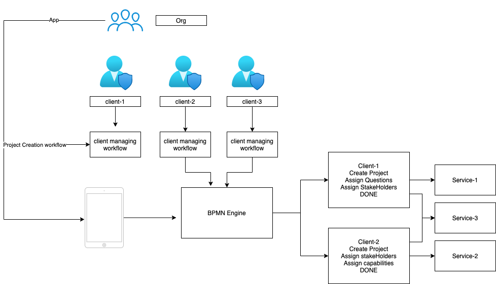
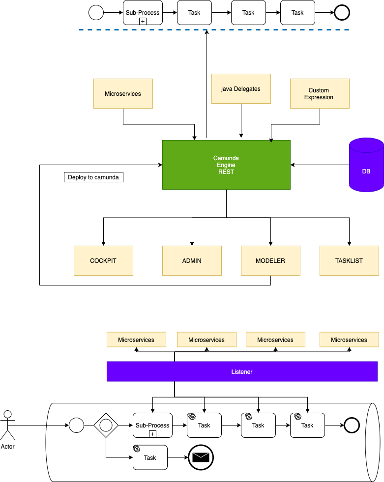
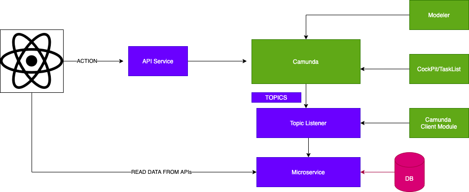
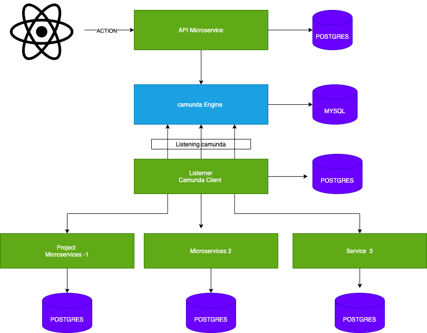

### Microservice workflow Orchestration using Camunda

](http://www.youtube.com/watch?v=XSlSk8hBtVs "")


Objective - The objective of this Blog is to orchestrate our Project Workflow using Camunda with Event-Driven Architecture considering the Camunda workflow  engine as Event Bus (State Manager)

Camunda - Camunda Platform is an open-source workflow and decision automation platform. Camunda Platform ships with tools for creating workflow and decision models, operating deployed models in production, and allowing users to execute workflow tasks assigned to them

Workflow - The Business Process Modeling Notation (BPMN) is a visual modeling language for business analysis applications and specifying enterprise process workflows, which is an open standard notation for graphical flowcharts that are used to define business process workflowsin short, all these things done by any BPMN modeler  [Camunda Modeler]

workflow orchestration is the automation of a workflow or multiple tasks. In other words, orchestration handles multiple automated tasks to execute a single significant process or workflow.

where workflow is a set of sequences or steps of tasks and data processes between these steps and on top of that when we configure, manage, execute then it becomes orchestration of workflow.

Workflow engines facilitate the flow of information, tasks, and events, it overall manages the state of the whole workflow tasks, success, failure, retry, executing the long-running tasks,s and many more. Camunda Engine is built in Java and Provides REST API integration with any external client.

Camunda workflow Basic Elements https://camunda.com/bpmn/reference/

### Project Workflow with Microservices 

#### with Real work example 

We have a specific requirement, where we have different client who can have their own workflow process to build a project or to automate any business.
Simple Example is Procurements for IT services, where one purchaser will come and define his own workflow to get IT services from different IT services using Defined workflow where Purchaser will create project, define stakeholders and send project definition to suppliers.



This workflow can be different for different purchaser and they want freedom to customize based on their organization need.

In Such scenario camunda can help to define business workflow for each and every client and they can use Camunda Modeler to draw this visually.

Now here the challenge is how can we manage different workflow needs of every client for a same project having set of microservices.

We have a common set of services that can do all these tasks we just need to provide a decoupled way of orchestration that can do all these tasks in any order based on workflow designed by the client.

### Designing this Architecture [camunda as  Event Bus]

Simple Event-driven architecture is nothing but decoupled services that are listening to events coming from events bus and they are not aware of the origin of the event and its purely event-driven, event occurred then listener service will act on it. Now, this approach is good but we are not aware of the state of the system as we don't have a track on events and overall what is happening in the system is not known at any point in time, 

Now if we just replace the event bus and put the workflow engine there it's still the same set of listener microservices but now camunda engine can track different tasks being executed by services and the overall system state can be driven by the workflow engine.

### How it works is 

```
Task 1 ---> External Command ----> if Completed ----> Task 2 ----> if Completed –-> Task -3
```

### What all resources we have 

- camunda which can run its camunda engine to execute workflow defined by clients 
- Microservices which can execute apis and get task done 
- we have camunda modeler to define workflow

### How we can use camunda as Event Bus

An event-driven architecture uses events to trigger and communicate between decoupled services and is common in modern applications built with microservices. An event is a change in state, or an update, like an item being placed in a shopping cart on an e-commerce website. Events can either carry the state (the item purchased, its price, and a delivery address) or events can be identifiers (a notification that an order was shipped).

Event-driven architectures have three key components: event producers, event routers, and event consumers. A producer publishes an event to the router, which filters and pushes the events to consumers. Producer services and consumer services are decoupled, which allows them to be scaled, updated, and deployed independently.

Now lets say we don't have Event Bus and we want use camunda as Event Bus 

### advantages of using camunda as event bus

[](http://www.youtube.com/watch?v=o3c5FP_xb7M "")

- camunda can manage the state of overall system 
- camunda can act as a driver and can execute this task in sequence defined by besiness
- camunda workflow can have tasks which are full filled by different microservices in a defined sequence and if there is any error camunda would be able to notify us.
- camunda is acting as a event bus which can execute these task by  talking to different microservices.

## Camuna and Camunda as Event Bus 



Camunda Bus is just executing workflow services task in sequence defined in a workflow

Now how should we design this whole architecture where we have UI which is sending Action to Camunda and based on client workflow 

- We have React UI to send action
- we have some microservices to get the task done and store data in DB.
- we have camunda engine to execute camunda Tasks 

Camunda Engine expose REST APIs which we can excute using UI or postman or by putting a microservices which will manage calling camunda, and we also need to understand how camunda makes external call using service task [its all done using camunda client listerner]
Camunda clients are available in different language 

You can understand it like when camunda needs to execute external task this client will take care of that

```javascript
const { Client, logger } = require("camunda-external-task-client-js");

// configuration for the Client:
//  - 'baseUrl': url to the Process Engine
//  - 'logger': utility to automatically log important events
const config = { baseUrl: "http://localhost:8080/engine-rest", use: logger };

// create a Client instance with custom configuration
const client = new Client(config);

// susbscribe to the topic: 'creditScoreChecker'
client.subscribe("creditScoreChecker", async function({ task, taskService }) {
  // Put your business logic
  // complete the task
  await taskService.complete(task);
});

```

Now this architecture will fit our requirement where we have workflow service to talk to camunda and listerner service to deal with external tasks and finally our UI which will make UI action, workflow will execute and external tasks will be done.





I have covered all about camunda and Orchestration of Microservices using Camunda 
Here is the Link - https://www.youtube.com/watch?v=XSlSk8hBtVs&list=PLIGDNOJWiL1-bKGF5lSfRDL4sIkkNI9kg
[](http://www.youtube.com/watch?v=XSlSk8hBtVs "camunda")
