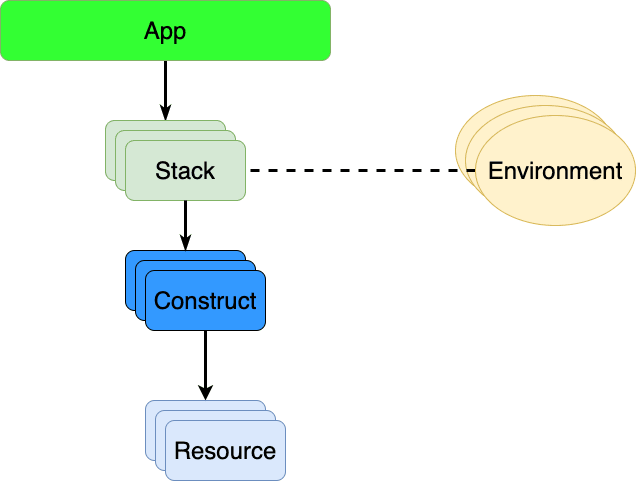
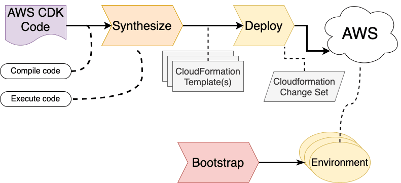

# Build and Deploy application using AWS CDK Part-1

| Part   | Link                                                                   |
| ------ | ---------------------------------------------------------------------- |
| Part-0 | https://tkssharma.com/aws-cdk-for-deploying-aws-resources-blogs-series |


In this blog we will cover all these Topics

- what is AWS CDK
- how can we use AWS-CDK
- Deploy a simple AWS Stack

what is AWS CDK

The AWS CDK tries to provide the expressive power of programming languages to make it possible to describe the cloud infrastructure at a level that is easier to grasp, even if it becomes more complex. Under the hood, it will still generate the CloudFormation descriptions, but make it possible to hide much of the complexity

AWS CDK ---> Cloudformation

Okay lets do it then, I have already covered basic here https://tkssharma.com/aws-cdk-managing-infra-as-code/ about CDK
Lets first see what CDK Provides

[](https://www.youtube.com/watch?v=h_gRGRbOjJ8)

example a VM creation on AWS

```javascript
const vpc = Vpc.fromLookup(stack, 'my-vpc', { isDefault: true });

new Instance(stack, 'my-ec2', {
  vpc,
  instanceType: InstanceType.of(InstanceClass.T3, InstanceSize.MICRO),
  machineImage: MachineImage.latestAmazonLinux(),
});
```

in this above example i am not worried about lots of details which we add in cloudformation template, so the advantage here is i don't need to know a whole lot of information
There are a few key concepts to keep in mind when using the AWS CDK:

- An App. This the top level container
- A Stack. This is a collection of AWS resources that you provision and manage as a unit
- A Construct. This is a logical grouping of one or more AWS resources and may also encapsulate certain logic, practices and conventions.
- A Resource. A unit of infrastructure in AWS, which is available via CloudFormation and AWS APIs primarily.
- An Environment. A specific combination of an AWS account and an AWS region.
- Synthesize. The process of executing CDK-based code to generate the corresponding CloudFormation representation.
- Deploy. The process of taking the underlying CloudFormation representation that has been generated in the synthesize step to actually provision (create, update or delete) AWS resources.
- Bootstrap. The process of preparing an environment for deployment with AWS CDK a one time process.

A CDK App will consist of a number of stacks, which in turn consists of one or more constructs. Each construct may encapsulate one or more resources.

AWS stake showing all building blocks stake, construct and AWS resources



The AWS CDK command-line tool is the primary tool to perform these process steps:
Once we are ready with development we run these few commands like `cdk synth`, `cdk deploy` from cli and this is high level flow
of execution of different steps in deployment flow, the final goal is create change-set that needs to be deployed from cloudformation template
cdk synth
cdk deploy
cdk bootstrap



## Lets create CDK App

Applying project template app for typescript

```sh
➜  bootstrap git:(main) ✗ cdk init app --language=typescript
```

# Welcome to your CDK TypeScript project

This is a blank project for TypeScript development with CDK.
The `cdk.json` file tells the CDK Toolkit how to execute your app.

## Useful commands

- `npm run build` compile typescript to js
- `npm run watch` watch for changes and compile
- `npm run test` perform the jest unit tests
- `cdk deploy` deploy this stack to your default AWS account/region
- `cdk diff` compare deployed stack with current state
- `cdk synth` emits the synthesized CloudFormation template

lets see all the files

```json
❯ tree -I node_modules
.
├── README.md
├── bin
│   └── bootstrap.ts
├── cdk.json
├── jest.config.js
├── lib
│   └── bootstrap-stack.ts
├── package-lock.json
├── package.json
├── test
│   └── bootstrap.test.ts
└── tsconfig.json
```

This is our default App which is using bootstrap Stack default created

```javascript
import 'source-map-support/register';
import * as cdk from 'aws-cdk-lib';
import { BootstrapStack } from '../lib/bootstrap-stack';

const app = new cdk.App();
new BootstrapStack(app, 'BootstrapStack', {
  /* If you don't specify 'env', this stack will be environment-agnostic.
   * Account/Region-dependent features and context lookups will not work,
   * but a single synthesized template can be deployed anywhere. */
  /* Uncomment the next line to specialize this stack for the AWS Account
   * and Region that are implied by the current CLI configuration. */
  // env: { account: process.env.CDK_DEFAULT_ACCOUNT, region: process.env.CDK_DEFAULT_REGION },
  /* Uncomment the next line if you know exactly what Account and Region you
   * want to deploy the stack to. */
  // env: { account: '123456789012', region: 'us-east-1' },
  /* For more information, see https://docs.aws.amazon.com/cdk/latest/guide/environments.html */
});
```

Lets clean this thing and understand the app and stack

```javascript
import { App, Stack } from 'aws-cdk-lib';

const app = new App();
const stack = new Stack(app, 'my-stack');
```

Here we have our app and one default stack with name "my-stack" but this code will not create any AWS resources as we are not creating anything, we just have app and stack, Lets add AWS resources with Stack

```javascript
The AWS CDK library has a number of submodules, one for each AWS service it supports (plus a few more). We want to use the aws-ec2 submodule. In that submodule we want to use the Instance class, that describes an EC2 instance resource.

We need to associate the instance with the stack we want to deploy, and we should give the instance a name as well. We use the same pattern as when we associated the stack with the AWS CDK App:
import { App, Stack } from 'aws-cdk-lib';
import { Instance } from 'aws-cdk-lib/aws-ec2';


const app = new App();
const stack = new Stack(app, 'my-stack');

const instance = new Instance(stack, 'my-ec2');
```

But looks like this information is not enough we need to pass some configuration also to EC2 instances like

- instanceType - the type of instance to launch
- machineImage - the Amazon Machine Image (AMI) to use
- vpc - the VPC to launch the EC2 instance

```javascript
const vpc = Vpc.fromLookup(stack, 'my-vpc', {
  isDefault: true,
});

const instance = new Instance(stack, 'my-ec2', {
  instanceType: InstanceType.of(InstanceClass.T2, InstanceSize.MICRO),
  machineImage: MachineImage.latestAmazonLinux(),
  vpc,
});
```

With this above example we are creating AWS ec2 instance in default VPC but do we know which account and region we are using, if not
we have to provide that info in our stack and make sure we have our AWS profile configured

```javascript
const vpc = Vpc.fromLookup(stack, 'my-vpc', {
  isDefault: true,
  env: {
    account: process.env.CDK_DEFAULT_ACCOUNT,
    region: process.env.CDK_DEFAULT_REGION,
  },
});
```

Now we can trigger basic CDK commands

```bash
cdk init
cdk synth
cdk bootstrap
cdk deploy
cdk destroy
```

- cdk bootstrap : we must run this command before deploy, this is one time command to initialize platform before deployment
- cdk deploy with provide user friendly interface and will expose all resources its creating
- aws destroy - it will destroy resources created
